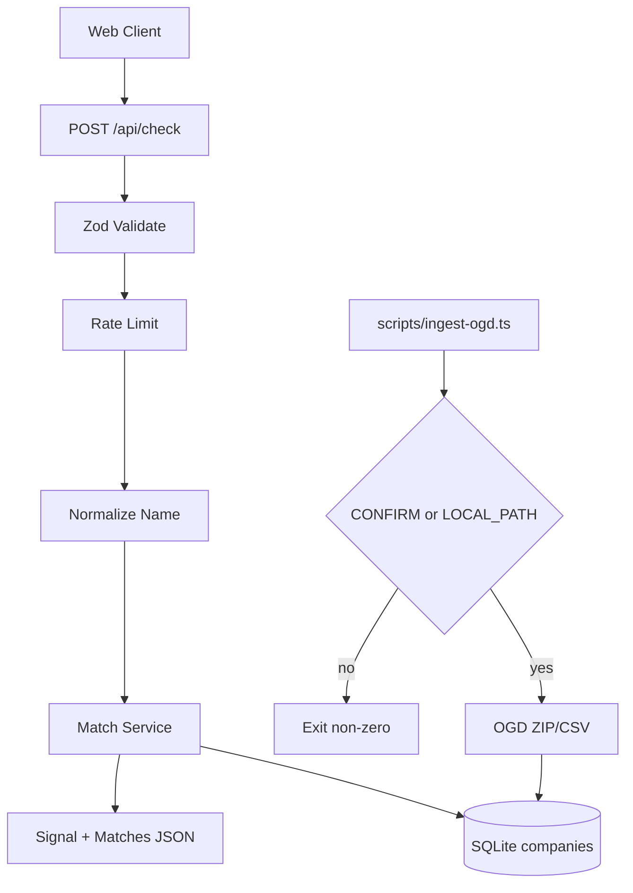

# Backend Architecture & Database Structure — Common Name

## 1. Architecture Overview

### System Architecture

- **Pattern:** RESTful JSON API via Next.js Route Handlers + domain services
- **Authentication:** None for public check (MVP)
- **Data Flow:** Client → `POST /api/check` → validate (Zod) → rate limit → normalize → match service → SQLite name index → JSON response
- **Caching Strategy:** Optional in-memory LRU for identical normalized queries (TTL 5 min)
- **Ingest Path:** Operator CLI → confirm gate → parse OGD → atomic SQLite replace



---

## 2. Database Schema

### Database: SQLite 3.x (`better-sqlite3`)

- **File:** `data/companies.sqlite` (gitignored)
- **Naming:** snake_case
- **Timestamps:** ISO-8601 text or integer unix — prefer ISO text for simplicity
- **Hard rule:** No director, DIN, shareholder, email, or personal address columns

### Entity Relationship

```
dataset_meta (1) ── describes snapshot used by ──► companies (N)
```

---

## 3. Tables & Relationships

### Table: `dataset_meta`

**Purpose:** Provenance and readiness of the name index. If missing or `row_count = 0`, API must fail closed.

| Column          | Type    | Constraints                     | Description                            |
| --------------- | ------- | ------------------------------- | -------------------------------------- |
| id              | INTEGER | PRIMARY KEY CHECK (id = 1)      | Singleton row                          |
| source_name     | TEXT    | NOT NULL                        | e.g. `data.gov.in Company Master Data` |
| source_url      | TEXT    | NOT NULL                        | Catalog or file origin URL             |
| snapshot_label  | TEXT    | NOT NULL                        | Human label e.g. `OGD 2026-07-22`      |
| snapshot_at     | TEXT    | NOT NULL                        | ISO date of dataset currency if known  |
| ingested_at     | TEXT    | NOT NULL                        | ISO datetime of ingest                 |
| row_count       | INTEGER | NOT NULL CHECK (row_count >= 0) | Companies loaded                       |
| checksum_sha256 | TEXT    | NULL                            | Hash of raw artifact                   |
| notes           | TEXT    | NULL                            | Operator notes                         |

**Indexes:** PK only

**Constraints:** Exactly one row when ready (`id = 1`)

---

### Table: `companies`

**Purpose:** Name-level registered company records for matching

| Column          | Type    | Constraints                        | Description                               |
| --------------- | ------- | ---------------------------------- | ----------------------------------------- |
| id              | INTEGER | PRIMARY KEY AUTOINCREMENT          | Internal id                               |
| cin             | TEXT    | UNIQUE, NOT NULL                   | Corporate Identification Number           |
| name            | TEXT    | NOT NULL                           | Registered company name as published      |
| normalized_name | TEXT    | NOT NULL                           | Suffix-stripped, lowercased, punct-folded |
| status          | TEXT    | NULL                               | e.g. Active / Strike Off (as in source)   |
| company_class   | TEXT    | NULL                               | Class if present in source                |
| state           | TEXT    | NULL                               | Registered state                          |
| registered_on   | TEXT    | NULL                               | Registration date (ISO or source format)  |
| created_at      | TEXT    | NOT NULL DEFAULT (datetime('now')) | Row insert time                           |
| updated_at      | TEXT    | NOT NULL DEFAULT (datetime('now')) | Row update time                           |

**Indexes:**

- `idx_companies_cin` UNIQUE ON (cin)
- `idx_companies_normalized_name` ON (normalized_name)
- `idx_companies_normalized_name_prefix` — rely on `normalized_name` btree; optional FTS5 virtual table `companies_fts(normalized_name, name)` if scale requires

**Relationships:** None to persons. No FK to directors.

**Forbidden columns (do not add):** director_name, din, dpin, email, mobile, residential_address, shareholder__, signatory__

---

### Optional Table: `rate_limit_buckets` (if not using memory)

MVP may keep rate limits in process memory. If multi-instance later:

| Column       | Type    | Constraints | Description        |
| ------------ | ------- | ----------- | ------------------ |
| key          | TEXT    | PRIMARY KEY | IP or hashed IP    |
| window_start | INTEGER | NOT NULL    | Epoch ms           |
| count        | INTEGER | NOT NULL    | Requests in window |

---

## 4. Normalization Rules

Implement in `lib/normalize.ts` (pure functions, heavily tested).

### Steps

1. Unicode NFKC normalize
2. Trim; collapse internal whitespace to single space
3. Lowercase
4. Remove punctuation except spaces (replace with space)
5. Strip legal suffixes / forms (order longest-first), including plurals/variants:
   - `private limited`, `pvt limited`, `pvt. ltd.`, `pvt ltd`, `p ltd`, `ltd.`, `ltd`, `limited`
   - `llp`, `limited liability partnership`
   - `opc`, `one person company`
   - `company`, trailing `co`, `co.`
6. Re-collapse whitespace; trim
7. If empty after strip → treat as invalid distinctive name

### Examples

| Input                     | Normalized       |
| ------------------------- | ---------------- |
| ACME Private Limited      | acme             |
| ACME PVT LTD              | acme             |
| Tekno Solutions Pvt. Ltd. | tekno solutions  |
| Techno Solutions          | techno solutions |

---

## 5. Matching Logic

### Pipeline (`lib/match.ts`)

1. Normalize query → `q`
2. **Exact:** `SELECT ... WHERE normalized_name = q` → `exactMatches`
3. **Candidates:** Tokenize `q`; for each significant token (length ≥ 3), SQL `LIKE '%' || token || '%'` OR FTS search; union limit 500
4. **Score:** Fuse.js (keys: `normalized_name`, weight 1; `name` weight 0.3) and/or Levenshtein ratio on `normalized_name`
5. **Phonetic boost (optional):** if double-metaphone primary keys equal, boost (Tekno/Techno)
6. **Filter:** keep score ≥ threshold (tune; start Fuse 0.4 threshold inverted carefully — document final constants in code)
7. **Rank:** exact first; then score desc; then name asc
8. **Cap:** return top 20; include `totalSimilar` count if available

### Match type labels

- `exact` — normalized equality
- `similar` — fuzzy/phonetic above threshold

### Uniqueness signal derivation

```
IF no dataset_meta OR row_count = 0 → error UNAVAILABLE
ELSE IF exactCount >= 1 → EXACT_TAKEN
ELSE IF similarCount >= 1 → SIMILAR
ELSE → LIKELY_UNIQUE
```

Signal strings must match APP_FLOW copy bank.

---

## 6. API Endpoints

### POST `/api/check`

**Purpose:** Check uniqueness of a proposed company name against local snapshot  
**Authentication:** Public  
**Framework:** Next.js 16 App Router Route Handler — `export async function POST(request: NextRequest)` returning `NextResponse.json` (Context7 `/vercel/next.js`)  
**Rate limit:** 30 / 15 min / IP

**Request Body:**

```json
{
  "name": "Tekno Solutions"
}
```

**Validation:**

- Zod **4.x** schema (TECH_STACK / Context7 `/colinhacks/zod`):

```ts
import { z } from "zod";

export const checkNameBodySchema = z.object({
  name: z.string().trim().min(2).max(120),
});

// In route handler:
const parsed = checkNameBodySchema.safeParse(await request.json());
if (!parsed.success) {
  return NextResponse.json(
    {
      error: {
        code: "VALIDATION_ERROR",
        message: "Validation failed",
        details: parsed.error.issues,
      },
    },
    { status: 400 },
  );
}
```

- `name`: string, trimmed length 2–120
- Reject suffix-only after normalize (400)
- Prefer `safeParse` over throwing `parse` in Route Handlers (awesome-cursorrules: model expected errors as return values)

**Response (200) — similar example:**

```json
{
  "query": {
    "raw": "Tekno Solutions",
    "normalized": "tekno solutions"
  },
  "signal": {
    "code": "SIMILAR",
    "message": "12 similar names exist — review carefully",
    "exactCount": 0,
    "similarCount": 12
  },
  "matches": [
    {
      "cin": "U72900KA2015PTC000000",
      "name": "Techno Solutions Private Limited",
      "status": "Active",
      "state": "Karnataka",
      "companyClass": "Private",
      "matchType": "similar",
      "score": 0.91
    }
  ],
  "meta": {
    "snapshotLabel": "OGD 2026-07-22",
    "snapshotAt": "2026-07-22",
    "sourceUrl": "https://data.gov.in/catalog/company-master-data",
    "returned": 12,
    "limit": 20
  },
  "links": {
    "mcaVerify": "https://www.mca.gov.in/"
  },
  "disclaimer": "This is a snapshot uniqueness signal. MCA live search and SPICe+ approval are authoritative."
}
```

**Response (200) — likely unique:**

```json
{
  "query": {
    "raw": "Zephryn Analytic Works",
    "normalized": "zephryn analytic works"
  },
  "signal": {
    "code": "LIKELY_UNIQUE",
    "message": "0 matches — likely unique in snapshot",
    "exactCount": 0,
    "similarCount": 0
  },
  "matches": [],
  "meta": {
    "snapshotLabel": "…",
    "snapshotAt": "…",
    "sourceUrl": "…",
    "returned": 0,
    "limit": 20
  },
  "links": { "mcaVerify": "https://www.mca.gov.in/" },
  "disclaimer": "This is a snapshot uniqueness signal. MCA live search and SPICe+ approval are authoritative."
}
```

**Errors:**

| Status | Code              | When                        |
| ------ | ----------------- | --------------------------- |
| 400    | VALIDATION_ERROR  | Invalid name / suffix-only  |
| 429    | RATE_LIMITED      | Too many requests           |
| 503    | INDEX_UNAVAILABLE | Missing meta or row_count 0 |
| 500    | SERVER_ERROR      | Unexpected                  |

**Error body:**

```json
{
  "error": {
    "code": "INDEX_UNAVAILABLE",
    "message": "Company name index unavailable. Snapshot not loaded."
  }
}
```

**Side Effects:** None on DB (read-only). Optional LRU cache write.

**Caching:** Key `check:{normalized}`; TTL 5 minutes; invalidate on ingest.

---

### GET `/api/health` (optional MVP)

**Purpose:** Liveness + index status  
**Response:**

```json
{
  "ok": true,
  "index": { "ready": true, "rowCount": 2500000, "snapshotAt": "2026-07-22" }
}
```

---

## 7. Authentication & Authorization

### Public Routes

- `POST /api/check`
- `GET /api/health`
- Pages `/`, `/about`

### Operator-only

- `pnpm db:ingest` — local/CI with secrets/env gate — **not** exposed as HTTP in MVP

### Password / JWT

- Not used in MVP

---

## 8. Data Validation Rules

### Name (API)

- Type string
- Trim; length 2–120
- Normalized distinctive part non-empty

### Ingest mapping

- Require CIN + Company Name columns (exact header names confirmed at first ingest — map flexibly with alias list)
- Skip rows missing CIN or name
- Never import director sheets if present in ZIP

### Content sanitization

- Strip control characters from name
- Do not render HTML from dataset; React text escaping

---

## 9. Error Handling

### Error Codes

- `VALIDATION_ERROR`: 400
- `RATE_LIMITED`: 429
- `INDEX_UNAVAILABLE`: 503
- `SERVER_ERROR`: 500

Log structure: `{ level, code, latencyMs, normalizedLength }` — do not log full PII (IP hashed optional).

---

## 10. Caching Strategy

1. **LRU memory:** recent normalized queries
2. **SQLite page cache:** OS-level

### Invalidation

- On successful ingest: clear LRU; replace DB file

---

## 11. Rate Limiting

| Endpoint        | Limit             |
| --------------- | ----------------- |
| POST /api/check | 30 / 15 min / IP  |
| GET /api/health | 120 / 15 min / IP |

Implementation: sliding window in memory (MVP). Response `Retry-After` seconds on 429.

---

## 12. Ingest & Migrations

### Schema bootstrap

- `scripts/init-db.ts` or migrate on first open: `CREATE TABLE IF NOT EXISTS …`

### Ingest process (`scripts/ingest-ogd.ts`)

1. If `CONFIRM_OGD_DOWNLOAD` ≠ `yes` AND `OGD_LOCAL_PATH` empty → **exit 1** with message
2. Obtain artifact (download only if confirmed; else read local path)
3. Parse CSV/ZIP entries for company master only
4. Write to `data/companies.sqlite.tmp`
5. Insert `dataset_meta`
6. Atomic rename over `companies.sqlite`
7. Print row_count + checksum

### Rollback

- Keep `companies.sqlite.bak` from previous successful ingest

### Fixture load

- `pnpm db:fixture` loads synthetic names for dev/tests — no network

---

## 13. Backup & Recovery

- **Dev:** Copy `data/companies.sqlite`
- **Prod:** Persistent disk snapshot / artifact in release
- **Recovery:** Restore bak file; restart service

---

## 14. API Versioning

- Current: unversioned `/api/check` (MVP)
- On breaking change: introduce `/api/v1/check`; keep old 6 months if public consumers exist

---

## 15. Explicit Non-Goals (Backend)

- No endpoints that proxy/scrape MCA live search
- No storage of director/signatory personal data
- No bulk “download entire live registry” job outside confirmed OGD path

---

## 16. References

- [RESEARCH_MCA.md](RESEARCH_MCA.md)
- [STANDARDS.md](STANDARDS.md)
- [PRD.md](PRD.md)
- [TECH_STACK.md](TECH_STACK.md)
- [APP_FLOW.md](APP_FLOW.md)
- [IMPLEMENTATION_PLAN.md](IMPLEMENTATION_PLAN.md)
- Context7: `/vercel/next.js`, `/colinhacks/zod`
