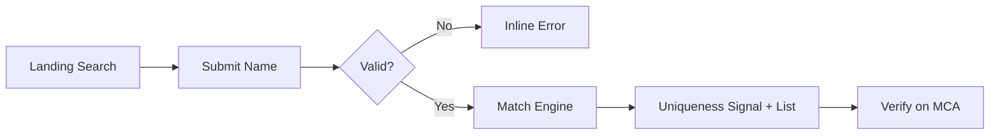

# Product Requirements Document: Common Name MVP

## Executive Summary

**Product:** Common Name  
**Version:** MVP (1.0)  
**Document Status:** Final (for MVP build)  
**Last Updated:** 2026-09-19  
**Owner:** Common Name project (workspace `common_name`)

### Product Vision

Give founders, company secretaries, and incorporation advisors a fast, transparent signal of how common or unique a proposed Indian company name is — using official MCA Company Master open data — before they pay time or fees on SPICe+ / name reservation. Results show exact and similar existing names, never a black-box score alone.

### Success Criteria

- User can submit one proposed name and receive a clear uniqueness signal within 3 seconds (p95) against the local snapshot.
- Every result lists closest matches (CIN + registered name + status) or an explicit empty-match state.
- Zero director/shareholder personal data stored or shown.
- Zero automated MCA portal scraping; OGD ingest only after explicit user confirmation.
- UI always links to official MCA verification and disclaims snapshot vs live authority.

---

## 1. Product Overview

- **Project Title:** Common Name
- **Tagline:** How unique is this company name in India’s MCA register?
- **Version:** 1.0 (MVP)
- **Platform:** Web (desktop + mobile responsive); optional CLI later (P2)

---

## 2. Problem Statement

### Problem Definition

Choosing a company name in India requires checking similarity against millions of registered companies and LLPs. The official MCA portal supports live checks, but the flow is multi-step, often CAPTCHA-gated, and does not present a simple “how common is this name?” uniqueness signal with transparent similar-name lists optimized for ideation. Founders iterate many name ideas; advisors repeat lookups. Unofficial scrapers and opaque APIs create ToS and trust risk.

### Impact Analysis

- **User Impact:** Faster shortlisting before SPICe+ Part A; fewer wasted reservation attempts due to obvious collisions.
- **Market Impact:** Every new incorporation and many name changes need a uniqueness check; demand is recurring per idea, not only per company.
- **Business Impact:** MVP is a focused utility (trust + clarity). Monetization deferred; value = accuracy transparency + compliance posture.

---

## 3. Goals & Objectives

### Business Goals

- Ship a trustworthy, ToS-respecting name uniqueness tool within one MVP cycle.
- Establish Common Name as the “snapshot + transparent matches” complement to MCA, not a fake MCA API.

### User Goals

- Type a proposed name (or pattern) and immediately see exact + similar collisions.
- Understand whether a name looks crowded vs sparse in the register.
- Know how to verify on the official MCA portal before filing.

### Success Metrics

- **Time-to-signal:** < 3s p95 for a single check (local index warm).
- **Result clarity:** ≥ 90% of test users correctly interpret signal without help (internal usability).
- **Compliance:** 0 portal scrape incidents; 0 personal-data fields in schema/UI.
- **Coverage honesty:** Snapshot date shown on 100% of result views.

---

## 4. Target Audience

### Primary Persona: Priya — First-time Founder

**Demographics:**

- Age 24–40, India (metro or tier-2), incorporating first Pvt Ltd or LLP
- Income varies; price-sensitive on government fees and CA costs

**Psychographics:**

- Wants a “cool” brandable name; anxious about rejection
- Prefers simple web tools over portal jargon

**Jobs to Be Done:**

1. Functional: Check if “Aurelia Labs” already exists or is too similar
2. Emotional: Feel confident shortlisting 2–3 names before paying an advisor
3. Social: Share a clear uniqueness summary with co-founders

**Current Solutions & Pain Points:**

| Current Solution           | Pain Points                                        | Our Advantage                           |
| -------------------------- | -------------------------------------------------- | --------------------------------------- |
| MCA Check Company/LLP Name | Slow iteration, CAPTCHA, weak “commonness” framing | Instant local signal + transparent list |
| CA / CS does it            | Cost, turnaround delay for ideation                | Self-serve ideation filter              |
| Random Google / LinkedIn   | Incomplete vs registry                             | Registry-name based (snapshot)          |

**Technical Proficiency:** Medium — comfortable with web forms

### Secondary Persona: Arjun — Practising CA / CS

**Demographics:** Handles multiple incorporations per month  
**Pain Points:** Clients send 10+ name options; portal checks are repetitive  
**Goals:** Fast triage of client lists; still verify on MCA before filing  
**Technical Proficiency:** High

### Tertiary Persona: Incorporation ops at a startup studio / legaltech desk

Needs batch later (P1); MVP = single query only.

---

## 5. User Stories

### Epic: Name Uniqueness Check

**Primary User Story:**  
"As a founder, I want to check how unique my proposed company name is against Indian registered company names so that I can shortlist names before filing on MCA."

**Acceptance Criteria:**

- [ ] I can enter a proposed name of 2–120 characters and submit
- [ ] I receive a uniqueness signal (exact / similar / likely unique)
- [ ] I see a list of closest matches with CIN, name, status (or empty state)
- [ ] I see the dataset snapshot date
- [ ] I can open an official MCA verification link
- [ ] No director or personal data appears

### Supporting User Stories

1. "As a user, I want legal-form suffixes ignored in matching so that `X Pvt Ltd` and `X Private Limited` collide correctly."
   - **AC:** Normalization rules applied before exact/fuzzy match

2. "As a user, I want similar spellings flagged so that `Tekno Solutions` and `Techno Solutions` appear as similar."
   - **AC:** Fuzzy/phonetic similarity returns ranked list with score band

3. "As a user, I want to know this is not legal approval so that I don’t treat the tool as MCA reservation."
   - **AC:** Persistent disclaimer + “Verify on MCA” CTA on results

4. "As an operator, I want to ingest official OGD company master names only after confirmation so that we stay within permitted access."
   - **AC:** Ingest script requires explicit env/flag confirmation; documented in IMPLEMENTATION_PLAN

---

## 6. Functional Requirements

### Core Features (MVP — P0)

#### Feature 1: Single Name Check

- **Description:** Web form accepts a proposed company name; server normalizes and searches the local index; returns uniqueness signal + matches.
- **User Value:** Instant ideation feedback
- **Business Value:** Core loop of the product
- **Acceptance Criteria:**
  - [ ] POST check returns within 3s p95 on warm index
  - [ ] Empty / invalid input shows inline validation
  - [ ] Rate limited per IP
- **Dependencies:** Local company-name index populated (fixtures OK for UI; production needs OGD after confirm)
- **Estimated Effort:** M

#### Feature 2: Matching Engine (Exact + Fuzzy)

- **Description:** Normalize suffixes/punctuation; exact match; fuzzy/token/phonetic similarity; rank top N (default 20).
- **User Value:** Catches near-duplicates, not only exact strings
- **Acceptance Criteria:**
  - [ ] Documented normalization table implemented
  - [ ] Exact matches labeled distinctly from similar
  - [ ] Deterministic ranking for same input
- **Estimated Effort:** L

#### Feature 3: Uniqueness Signal

- **Description:** Human-readable signal, e.g.:
  - `0 matches — likely unique in snapshot`
  - `3 exact matches — name appears taken`
  - `12 similar names exist — review carefully`
- **Acceptance Criteria:**
  - [ ] Signal derived from counts, not opaque ML
  - [ ] Signal text + counts both shown
  - [ ] Color is not the only indicator (icon/text)
- **Estimated Effort:** S

#### Feature 4: Transparent Match List

- **Description:** Table/list of closest companies: registered name, CIN, status, optional state/class.
- **Acceptance Criteria:**
  - [ ] Max 20 shown by default with “showing top N of M”
  - [ ] Sort by similarity then exactness
- **Estimated Effort:** S

#### Feature 5: Compliance UX

- **Description:** Snapshot date, source attribution (MCA / data.gov.in), disclaimer, MCA deep-link.
- **Acceptance Criteria:**
  - [ ] Always visible on results
  - [ ] No claim of legal name reservation
- **Estimated Effort:** S

### Should Have (P1)

- Multi-name paste check (up to 10 names)
- LLP-only / Company-only filter if dataset supports
- Export matches CSV
- Operator UI for “last ingest status”

### Could Have (P2)

- CLI (`npx common-name check "..."`)
- Trademark cross-check guidance (link to IP India only — not legal advice)
- User-uploaded OGD ZIP ingest

### Out of Scope (Won't Have)

- **MCA portal scraping / CAPTCHA bypass:** Violates access terms and brief
- **Director/shareholder personal data:** Privacy and brief boundary
- **Full registry scrape retention outside OGD ingest:** Not permitted without explicit confirmation of intent + terms
- **Guaranteed name availability / legal opinion:** MCA/SPICe+ remains authority
- **User accounts / payments (MVP):** Not required for single-query tool
- **Trademark clearance engine:** Different registry; P2 link-only at most

---

## 7. User Scenarios

### Scenario 1: Likely unique name

- **Context:** Founder tries `Zephryn Analytic Works`
- **Steps:** Enter name → Submit → See `0 matches — likely unique in snapshot` → Click Verify on MCA
- **Expected Outcome:** Empty match list; confidence to proceed to official check
- **Edge Cases:** Index empty → show “dataset not loaded” error, not “unique”

### Scenario 2: Crowded name

- **Context:** Founder tries `Techno Solutions`
- **Steps:** Submit → See many similar + maybe exact → Review list → Discard or modify name
- **Expected Outcome:** Clear “similar names exist” signal with transparent rows

### Scenario 3: Suffix variation

- **Context:** `Acme Private Limited` vs existing `ACME PVT LTD`
- **Steps:** Submit → Exact (normalized) match highlighted
- **Expected Outcome:** Treated as collision despite suffix wording

---

## 8. Non-Functional Requirements

### Performance

- **Page Load:** < 2 seconds (p95) for static shell
- **API Response:** < 3 seconds (p95) name check (warm)
- **Concurrent Users:** Support 100 concurrent checks (MVP)
- **Uptime:** Best-effort for MVP; 99% target if hosted

### Security

- **Authentication:** None for public check (MVP)
- **Authorization:** N/A public; ingest scripts operator-only (local/CI secret)
- **Data Protection:** No PII collected; HTTPS in production
- **Compliance:** NDSAP/OGD attribution; no personal data processing beyond IP for rate limits

### Usability

- **Accessibility:** WCAG 2.1 AA
- **Browser Support:** Chrome, Safari, Firefox, Edge (latest 2)
- **Mobile Support:** Responsive; touch targets ≥ 44px
- **Internationalization:** English (India) MVP; Hindi later (P2)

### Scalability

- Index size: full India company master (millions of rows) — design for SQLite FTS / trigram capable path
- Geographic: Single region deploy OK for MVP

---

## 9. Quality Standards (Anti-Vibe Rules)

Aligned with [STANDARDS.md](STANDARDS.md) (Context7 + awesome-cursorrules).

### Code Quality Requirements

- **Type Safety:** Strict TypeScript, no `any`
- **Architecture:** Thin route handlers — matching/ingest in services; Server Components by default
- **Error Handling:** Explicit error types; no swallowed exceptions; Zod 4 on boundaries
- **Testing:** ≥ 80% coverage on normalize + match critical paths
- **Docs freshness:** Implement against Context7 + TECH_STACK pins, not outdated tutorials

### Design Quality Requirements

- Tailwind v4 `@theme` tokens only — no raw hex in components
- WCAG 2.1 AA verified
- Core Web Vitals in green zone on result page

### What This Project Will NOT Accept

- Placeholder “Lorem” in production UI
- Features outside current phase
- Skipped tests on matching logic
- MCA scrape “just for now” shortcuts
- Pages Router patterns
- Tailwind v3-only theme config when v4 `@theme` is the stack standard

---

## 10. UI/UX Requirements

### Design Principles

1. **One job:** First viewport = brand + one search + one CTA
2. **Transparency over magic:** Show matches, not only a score
3. **Honest authority:** Snapshot ≠ MCA approval

### Information Architecture

```
├── / (Search + Results)
├── /about (How it works, data source, disclaimer)
└── /api/check (JSON API)
```

### Key User Flow



---

## 11. Success Metrics

### North Star Metric

Number of name checks that complete with a correctly rendered signal + match list (weekly).

### OKRs for MVP (First 90 Days)

**Objective 1:** Ship trustworthy uniqueness checks

- **KR1:** Matching unit tests green for normalize + fuzzy fixtures (≥ 30 cases)
- **KR2:** Snapshot date visible on 100% of successful responses
- **KR3:** 0 personal-data fields in DB schema review

### Metrics Framework

| Category    | Metric                               | Target   | Measurement              |
| ----------- | ------------------------------------ | -------- | ------------------------ |
| Acquisition | Unique visitors                      | Baseline | Analytics                |
| Activation  | Completed checks / visit             | ≥ 40%    | Event `check_complete`   |
| Retention   | Return checks / 7d                   | Baseline | Analytics                |
| Trust       | Disclaimer CTR / MCA link clicks     | Track    | Event `mca_verify_click` |
| Compliance  | Unauthorized scrape attempts in code | 0        | Code review              |

---

## 12. Constraints & Assumptions

### Constraints

- **Budget:** Bootstrapped MVP
- **Timeline:** Docs complete first; build after OGD download confirmation
- **Technical:** No official MCA public search API; Render ephemeral FS if deployed there
- **Legal:** Must respect NDSAP/OGD and MCA portal ToS

### Assumptions

- OGD Company Master Data includes usable company name + CIN fields at sufficient freshness for ideation
- Users understand “likely unique in snapshot” is not reservation
- English UI sufficient for MVP

### Open Questions

- Exact OGD ZIP schema column names (confirm at first ingest)
- Whether LLP names are in same catalog or separate file (handle in ingest)

### Dependencies

- data.gov.in / MCA Company Master Data availability
- User confirmation before bulk download
- Hosting (Vercel/Render) + durable storage for index if not rebuilt on boot

---

## 13. Risk Assessment

| Risk                                | Probability | Impact   | Mitigation                                                     |
| ----------------------------------- | ----------- | -------- | -------------------------------------------------------------- |
| OGD dataset stale vs live MCA       | High        | Med      | Show snapshot date; MCA verify CTA                             |
| OGD download blocked / rate-limited | Med         | High     | Confirm-before-download; fixture mode; manual upload path (P1) |
| False “unique” when index empty     | Med         | Critical | Fail closed if dataset_meta missing                            |
| Scope creep into scrape/API         | Med         | High     | Out-of-scope locked in PRD + RESEARCH_MCA                      |
| Fuzzy false positives               | High        | Med      | Show list; tune thresholds; exact band separate                |

---

## 14. MVP Definition of Done

### Feature Complete

- [ ] All P0 features implemented
- [ ] All acceptance criteria met
- [ ] Code review completed

### Quality Assurance

- [ ] Unit tests on normalize + match ≥ 80% of those modules
- [ ] Integration test for `/api/check`
- [ ] Manual check of disclaimer + MCA link
- [ ] Accessibility pass (keyboard, contrast, signal not color-only)

### Documentation

- [ ] RESEARCH_MCA.md current
- [ ] This PRD + sibling docs aligned
- [ ] README with run + ingest confirmation note

### Release Ready

- [ ] Staging validated with fixture or confirmed OGD index
- [ ] Monitoring for 5xx on `/api/check`
- [ ] Rollback: previous index file retained on ingest

---

## 15. References & Resources

- [RESEARCH_MCA.md](RESEARCH_MCA.md)
- [STANDARDS.md](STANDARDS.md)
- [APP_FLOW.md](APP_FLOW.md)
- [TECH_STACK.md](TECH_STACK.md)
- [FRONTEND_GUIDELINES.md](FRONTEND_GUIDELINES.md)
- [BACKEND_STRUCTURE.md](BACKEND_STRUCTURE.md)
- [IMPLEMENTATION_PLAN.md](IMPLEMENTATION_PLAN.md)
- OGD: https://data.gov.in/catalog/company-master-data
- MCA: https://www.mca.gov.in/
- Context7 library IDs: see TECH_STACK.md §1b
- awesome-cursorrules: Next App Router / TS / Zod / Tailwind family (see STANDARDS.md)
